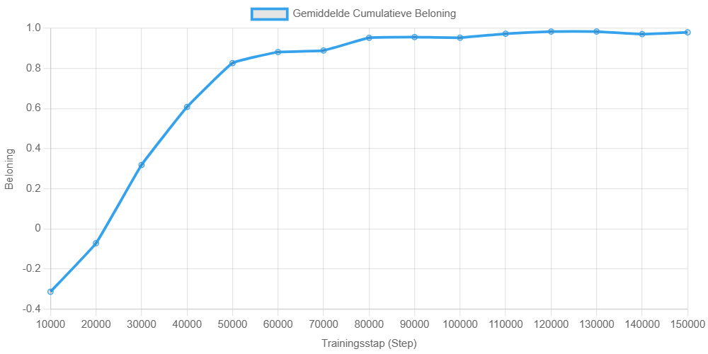
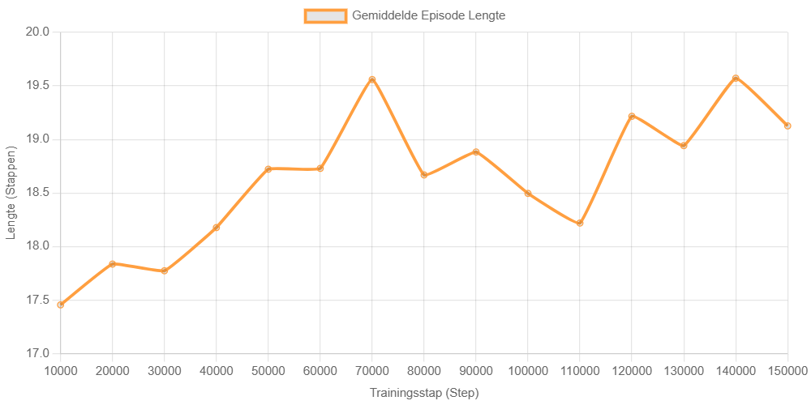
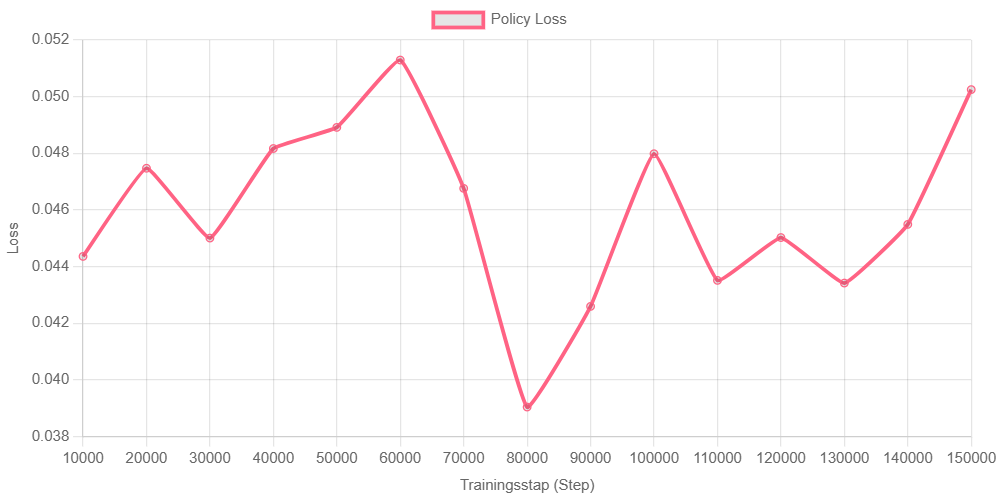
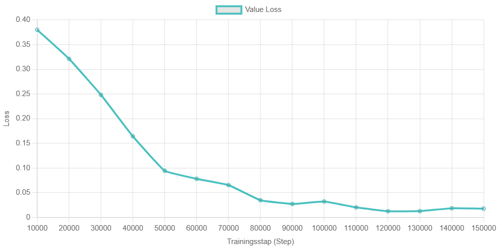

# Zelflerende Springende Agent met Unity ML-Agents

Dit project demonstreert de implementatie van een zelflerende agent in Unity die leert over een obstakel te springen. Het obstakel krijgt bij elke episode een willekeurige snelheid. De agent wordt getraind met behulp van Unity ML-Agents en het PPO-algoritme.

Voor de **volledige interactieve documentatie, inclusief gedetailleerde setup-instructies, code en live grafieken**, bezoek de [Project Webpagina](https://ap-it-gh.github.io/jumper-assignment-swazzyb12/index.html)

## Project Overzicht

Het doel is om een agent te trainen die leert om op het juiste moment te springen om een naderend obstakel te ontwijken. De snelheid van het obstakel varieert, waardoor de agent moet leren zich aan te passen aan verschillende situaties.

De episode eindigt wanneer de agent botst (negatieve beloning) of succesvol springt (positieve beloning). Als het obstakel de agent passeert zonder interactie, reset het obstakel zichzelf en de episode van de agent loopt door.

## Benodigdheden

*   Unity Editor (bijv. 2020.3 LTS of nieuwer)
*   Unity ML-Agents Toolkit (bijv. Release 19+)
    *   C# package: `com.unity.ml-agents`
    *   Python package: `mlagents`
*   Python (bijv. 3.7+)
*   Benodigde Python libraries (zie `requirements.txt`): `torch`, `onnx`, etc.

## Installatie en Gebruik

1.  **Kloon de repository:**
    ```bash
    git clone https://github.com/AP-IT-GH/jumper-assignment-swazzyb12.git
    cd jumper-assignment-swazzyb12
    ```
2.  **Zet de Python environment op:**
    Het wordt aanbevolen om een virtuele omgeving te gebruiken.
    ```bash
    python -m venv .venv
    source .venv/bin/activate  # Op Linux/macOS
    # .venv\Scripts\activate  # Op Windows
    pip install -r requirements.txt
    ```
3.  **Open het Unity project** in de Unity Hub/Editor (de map die de `Assets` folder bevat).
4.  **Training:**
    *   Controleer de `config/jumper_config.yaml`.
    *   Start de training vanuit de terminal (in de geactiveerde Python environment en project root):
        ```bash
        mlagents-learn config/jumper_config.yaml --run-id=JumperAgent_Training1
        ```
    *   Druk op Play in de Unity Editor.
    *   Om een training te hervatten: `mlagents-learn config/jumper_config.yaml --resume --run-id=<ORIGINELE_RUN_ID>`
5.  **Getraind model gebruiken:**
    *   Plaats het resulterende `.onnx` bestand (uit `results/<run_id>/`) in het Unity project.
    *   Wijs dit model toe aan de `Behavior Parameters` component van de `Agent` GameObject.

## Resultaten (Samenvatting)

De agent is getraind voor 150.000 stappen. Hieronder een overzicht van de trainingsstatistieken.

### Cumulatieve Beloning

De agent toonde een duidelijke leercurve, waarbij de gemiddelde cumulatieve beloning steeg van een negatieve waarde naar een stabiel positief niveau rond +0.95 tot +0.98. Dit indiceert dat de agent de taak succesvol leerde uitvoeren (één punt voor een succesvolle sprong).



### Episode Lengte

De gemiddelde episode lengte bleef relatief constant, schommelend tussen de 17 en 19 stappen. Dit is consistent met het ontwerp waarbij een episode snel eindigt na een succesvolle sprong of een botsing.



### Policy Loss

De policy loss bleef gedurende de training laag en relatief stabiel, met waarden rond de 0.04-0.05. Dit suggereert een stabiel leerproces voor het actiebeleid van de agent.



### Value Loss

De value loss vertoonde een significante daling in de vroege trainingsfasen, van ongeveer 0.38 naar waarden onder de 0.03, en stabiliseerde daarna op een laag niveau. Dit duidt erop dat de agent steeds beter werd in het voorspellen van de toekomstige waarde van zijn toestanden.

`

**Voor een gedetailleerde analyse, interactieve grafieken, en de volledige project setup, zie de [Project Webpagina](https://ap-it-gh.github.io/jumper-assignment-swazzyb12/index.html).**

## Scripts en Configuratie

De kernlogica is geïmplementeerd in twee C# scripts:
*   **`AgentJump.cs`**: Bevat de logica voor de ML-Agent, inclusief observaties, acties, beloningen en episodebeheer.
*   **`ObstacleMovement.cs`**: Stuurt de beweging en het resetten van het obstakel.

De trainingsparameters worden gedefinieerd in **`config/jumper_config.yaml`**.

Gedetailleerde code en configuratie-uitleg zijn te vinden op de [Project Webpagina](https://ap-it-gh.github.io/jumper-assignment-swazzyb12/index.html).

## Probleemoplossing

*   **Agent leert niet:** Controleer beloningsfunctie, observaties, hyperparameters.
*   **`Module onnx is not installed!` error:** Installeer `onnx` via pip: `pip install onnx`.
*   Voor overige problemen, zie de uitgebreide documentatie op de [Project Webpagina](https://ap-it-gh.github.io/jumper-assignment-swazzyb12/index.html).

---